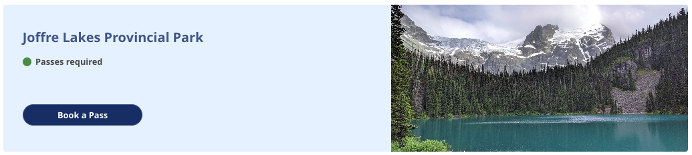
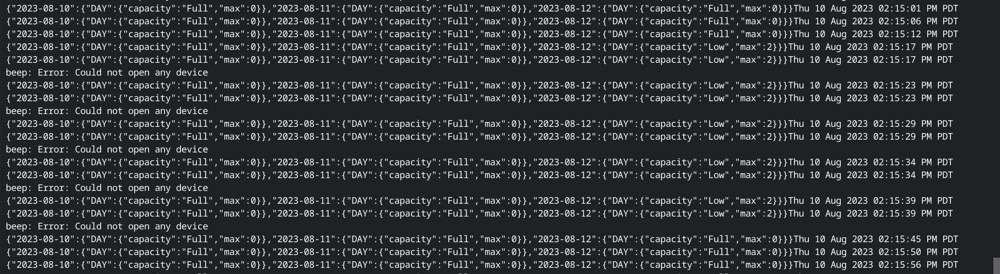
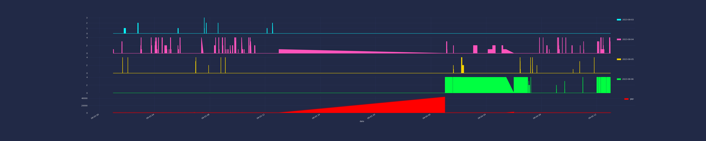
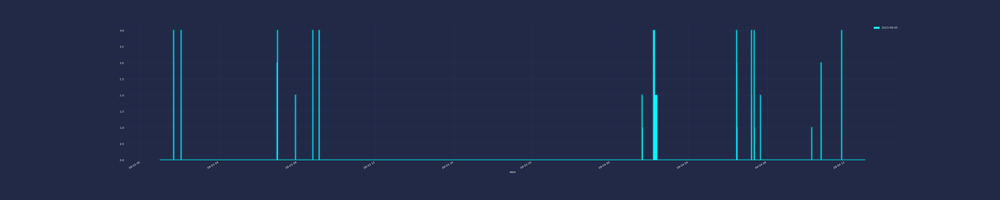

# INTRO

British Colombia has day-use pass for some popular parks. Sometimes it's difficult to get them 
because of so many people are trying to get them.

So, this small "helper" is providing notification about availability of one-day-passes on Joffre Lake 
and helping to get them as soon as they will be available, because, as I found during analytics:

1) even website saying that "Passes can be booked starting at 7:00am, two days in advance of your 
planned visit." - this is not correct... Passes appearing around 1:30 am and by 7:01am they are 
already gone

2) if somebody cancelled their passes - they are appearing online, but during the day they booked out 
in less then 20-40 seconds and at night they can be available for more then 10 minutes


So, prepare autofill information in your browser, just need:
- first name, 
- last name 
- and email address (note that you can only get 1 reservation for single email) 

and keep website https://reserve.bcparks.ca/dayuse/registration ready to be refreshed as soon as 
computer will start beeping

## Collector

Main script `./JoffreLakes.sh` is helping to receive notification in bash (beep) that tickets for 
particular day become available.

Output is `log.txt` file which can be used for analyzing purposes, but main purpose is realtime notification

### HELP
```
$ ./JoffreLakes.sh --help
Usage: JoffreLakes.sh [ -d | --day ] [ -s | --secondday ] [ -p | --park ] [ -h | --help ]

                        -d | --day:
                                by default is 2 days ahead (2023-08-17)
                                day when you are looking for tickets
                                expecting YYYY-MM-DD format

                        -s | --secondday:
                                by default empty
                                second day when you are okay to get tickets
                                expecting YYYY-MM-DD format

                        -p | --park:
                                by default Joffre - since it's the only park where you need ticket per person, not per car

                                Choose your park out of available options:
                                1) Joffre - for Joffre Lakes
                                2) Garibaldi-Diamond - for Diamond Head in Garibaldi Provincial Park
                                3) Garibaldi-Rubble - for Rubble Creek in Garibaldi Provincial Park
                                4) Garibaldi-Cheakamus - not supported yet, due to morning and evening options
                                5) Golden-Boat - for Alouette Lake Boat Launch Parking in Golden Ears Provincial Park
                                6) Golden-South - not supported, due to morning and evening options
                                7) Golden-Gold - not supported, due to morning and evening options
                                8) Golden-West - not supported, due to morning and evening options

                        -h | --help:
                                show this help message
```

### RUN
```
$ ./JoffreLakes.sh -d2023-07-15 --secondday=2023-07-16 --park=1
CHECKING PASSES FOR:
                DATE(S): 2023-07-15 2023-07-16
                PARK: Joffre Lakes

        Please CTRL+C when you want to stop the script

Checking beep command...
beep: Error: Could not open any device
if you didn't hear a beep sound, please check your speakers and try to run 'beep' command in your console.

{"2023-08-15":{"DAY":{"capacity":"Full","max":0}},"2023-08-16":{"DAY":{"capacity":"Full","max":0}},"2023-08-17":{"DAY":{"capacity":"Full","max":0}}}Tue 15 Aug 2023 11:08:03 AM PDT
{"2023-08-15":{"DAY":{"capacity":"Full","max":0}},"2023-08-16":{"DAY":{"capacity":"Full","max":0}},"2023-08-17":{"DAY":{"capacity":"Full","max":0}}}Tue 15 Aug 2023 11:08:09 AM PDT
{"2023-08-15":{"DAY":{"capacity":"Full","max":0}},"2023-08-16":{"DAY":{"capacity":"Full","max":0}},"2023-08-17":{"DAY":{"capacity":"Full","max":0}}}Tue 15 Aug 2023 11:08:14 AM PDT
```

## Analyzer
`./plot.py` providing some plots based on log information from `./JoffreLakes.sh`, such as:

Date when information has been collected
How many tickets (up-to 4) was available at this moment for current and next 2 days
Gap if script was not running at some time and log is inconsistent

Output is 4 files:
- `log.df` - panda dataframe file which can be used for testing instead of re-processing log file each time
- `plot.png` - plot for full period and each available day available in `log.txt`

- `plot-2023-08-05.png` - plot for full period, but only for 2023-08-05 passes

- `plot-2023-08-05.png` - plot for limited period (`2023-08-04 00:00:00 - 2023-08-04 08:00:00`) 
and only for 2023-08-06 passes


